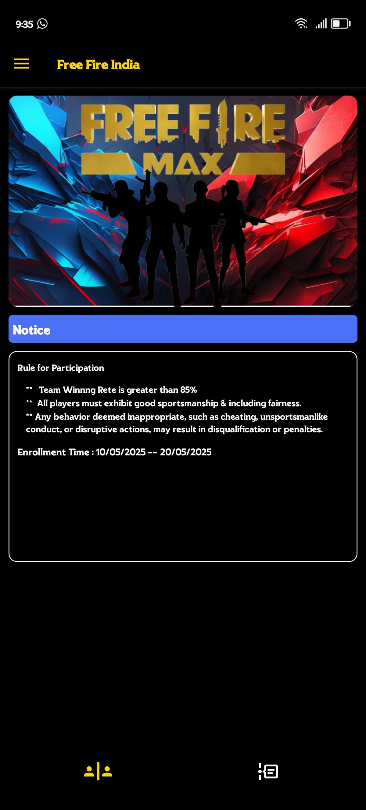
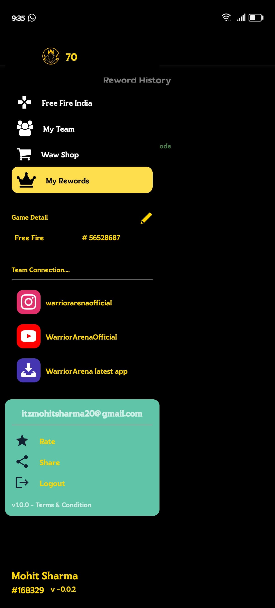
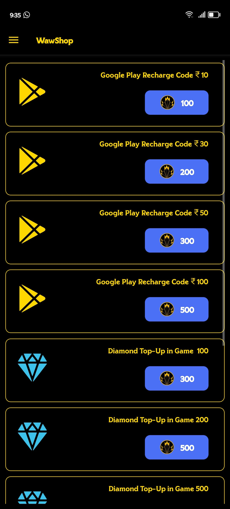

# Casual Gaming Events & Tournaments App

_An app designed to bring together casual gamers for fun gaming events, tournaments, and general gaming enjoyment._

## Table of Contents
1. [About the Project](#about-the-project)
2. [Features](#features)
3. [Screenshots](#screenshots)
4. [Installation](#installation)
5. [Usage](#usage)
6. [Technologies Used](#technologies-used)
7. [Contributing](#contributing)
8. [License](#license)
9. [Contact](#contact)

---

## About the Project

This app is built to enhance the experience of casual gaming events and tournaments. Whether you're planning a small gaming party with friends or organizing larger community tournaments, this app is designed to make gaming fun and engaging for everyone. It's perfect for gamers of all skill levels who are looking for a seamless and enjoyable way to connect and compete.

---

## Features

- Organize and manage gaming events effortlessly
- Track scores and standings in real-time
- Create and join tournaments with ease
- Customizable gaming modes and formats
- User-friendly interface for smooth navigation

---

## Screenshots

   
   
   
   
   
  

  

---

## Installation

To get started with the app, follow these steps:
1. Clone the repository: `https://github.com/moohhiit/WarriorsArena.git`
2. Navigate to the project directory: `cd WarriorsArena`
3. Install dependencies: `npm install` (or relevant command)
4. Start the app: `npm run android` (or relevant command)

---

## Usage

1. Open the app and create a gaming event.
2. Customize settings such as the number of players, games, and tournament format.
3. Share the event link with participants or invite them directly.
4. Let the games begin and track scores in real-time.

---

## Technologies Used

- React Native (or specify the framework used)
- Firebase for real-time updates
- Firebase for the backend
- Firebase Auth for Authantication 

---

## Contributing

We welcome contributions! Here's how you can get involved:
1. Fork the project
2. Create a new branch: `git checkout -b feature-branch`
3. Commit your changes: `git commit -m "Add feature"`
4. Push to the branch: `git push origin feature-branch`
5. Submit a pull request

## Contact

Feel free to reach out for collaboration or feedback:
- GitHub: [Your Profile](https://github.com/moohhiit/WarriorsArena)
- Email: itzmohitsharma20@gmail.com
